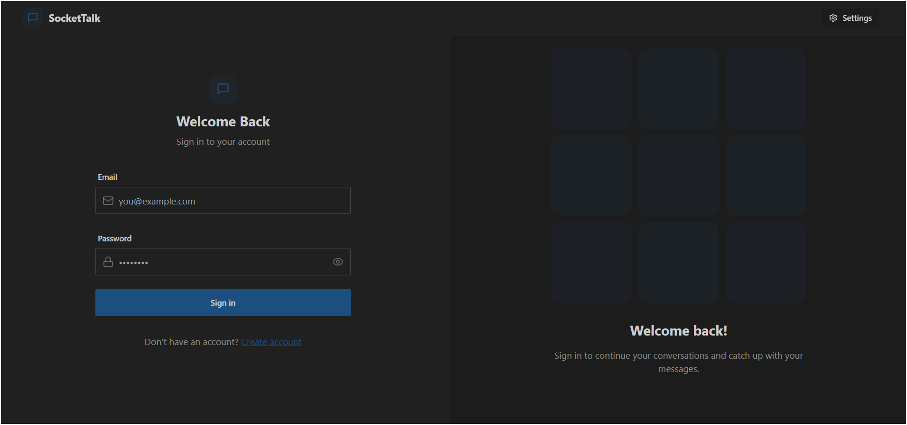
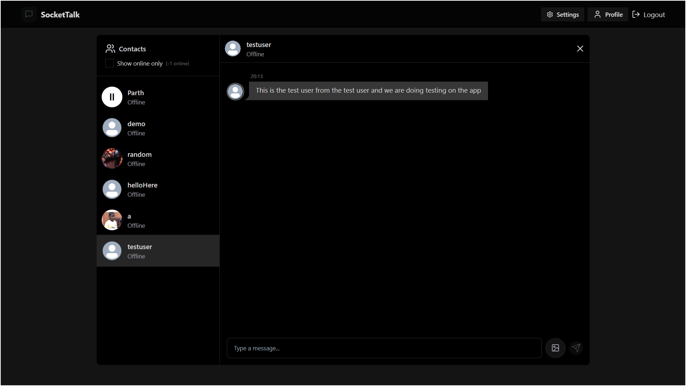
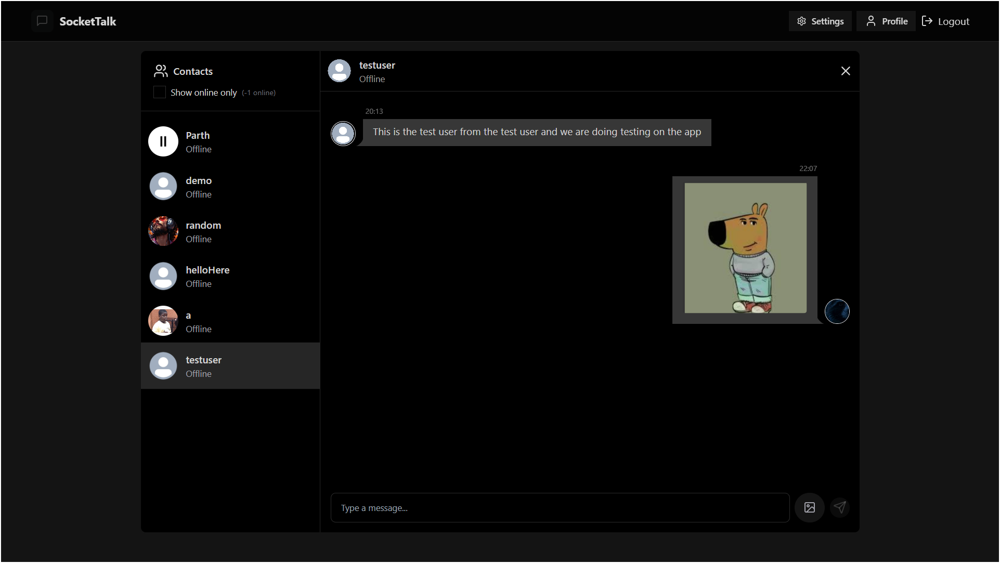
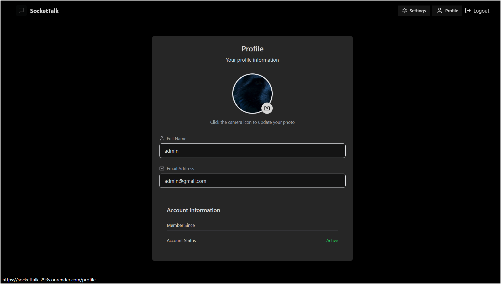

## 🚀 App Preview – Screenshots & Features

Take a peek into the experience! Here's a visual walkthrough of what our app delivers:

---

### 🧑‍💻 1. Welcome Aboard – Login & Signup

- Smooth onboarding flow  
- Clean UI with intuitive inputs

---

### 🎨 2. Full Tailwind Theming 🌈  

- Consistent design across all pages  
- Dark mode ready (and looks slick!)

---

### 💬 3. Chat Like a Pro – Messaging Interface

- Real-time chat with scrollable history  
- Minimalist layout, maximum usability

---

### 🔄 4. Never Miss a Beat – Chat Continuation

- Automatically continues chat threads  
- Smooth conversation flow – just like WhatsApp

---

### 📁 5. Share It All – File Transfer Made Easy

- Send files with one click  
- Previews and confirmation dialogs included

---

### ✅ 6. Transfer Complete – Confirmation UI  

- Get visual confirmation when files are sent  
- Built-in reliability indicators

---

### 👤 7. User Profiles – With Join Time 🕒  

- See when users joined  
- Basic profile customization

---

### ✏️ 8. Update Your Vibe – Profile Picture Change

- Quick avatar updates  
- Click to upload, crop, and save

---

### ⏳ 9. Smooth Loaders – Shimmer Skeleton UI (Redux Toolkit)

- UX-friendly loaders while data fetches  
- Powered by Redux Toolkit for state management

---
